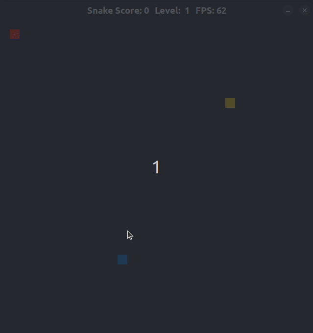

# CPPND: Capstone Snake Game Example

This is a repo for the Capstone project in the [Udacity C++ Nanodegree Program](https://www.udacity.com/course/c-plus-plus-nanodegree--nd213). The code for this repo was inspired by [this](https://codereview.stackexchange.com/questions/212296/snake-game-in-c-with-sdl) excellent StackOverflow post and set of responses.

The Capstone Project gave me a chance to integrate what I have learned throughout this program.

In this project, I have extended the functionality and performance of the Snake Game.

## Summary of added features based on Ruberic points provided by Udacity
1) The submission must compile and run without errors on the Udacity project workspace
   * The submission is compiles and runs without errors or warnings.
3) The project accepts user input and processes the input.
   * The Project accepts user inputs in the form of direction key entries to run the snake.
5) The project uses data structures and immutable variables.
   * Use of vectors is made where possible. 
7) One or more classes are added to the project with appropriate access specifiers for class members.
   * The project is developed based on OOP principles.
10) The project makes use of references in function declarations.
   * References are used where possible.
12) The project uses scope / Resource Acquisition Is Initialization (RAII) where appropriate.
   * See Snake.cpp
13) The project follows the Rule of 5.
   * See Snake.cpp
14) The project uses move semantics to move data instead of copying it, where possible.
   * See Snake.cpp
15) The project uses smart pointers instead of raw pointers.
   * See Snake.cpp and Game.cpp
16) The project uses multithreading.
   * See Game.cpp
17) A mutex or lock is used in the project.
   * See Game.cpp

## Additional functionality
1) A separate label for "Level" is now introduced. The Level increases when the snake eats food in the multiple of 5.
2) Also, the speed of the snake increases with Level now and not with every food.
3) A bonus food is now added which is available for 10 seconds and eating it can increase the speed of the snake and its length.
4) The Screen boundary is the wall and the Game is Over if the Snake hits it.
...There is plenty of scope to add more features.

## Dependencies for Running Locally
* cmake >= 3.7
  * All OSes: [click here for installation instructions](https://cmake.org/install/)
* make >= 4.1 (Linux, Mac), 3.81 (Windows)
  * Linux: make is installed by default on most Linux distros
  * Mac: [install Xcode command line tools to get make](https://developer.apple.com/xcode/features/)
  * Windows: [Click here for installation instructions](http://gnuwin32.sourceforge.net/packages/make.htm)
* SDL2 >= 2.0
  * All installation instructions can be found [here](https://wiki.libsdl.org/Installation)
  >Note that for Linux, an `apt` or `apt-get` installation is preferred to building from source. 
* gcc/g++ >= 5.4
  * Linux: gcc / g++ is installed by default on most Linux distros
  * Mac: same deal as make - [install Xcode command line tools](https://developer.apple.com/xcode/features/)
  * Windows: recommend using [MinGW](http://www.mingw.org/)

## Basic Build Instructions

1. Clone this repo.
2. Make a build directory in the top level directory: `mkdir build && cd build`
3. Compile: `cmake .. && make`
4. Run it: `./SnakeGame`.

## CC Attribution-ShareAlike 4.0 International

Shield: [![CC BY-SA 4.0][cc-by-sa-shield]][cc-by-sa]

This work is licensed under a
[Creative Commons Attribution-ShareAlike 4.0 International License][cc-by-sa].

[![CC BY-SA 4.0][cc-by-sa-image]][cc-by-sa]

[cc-by-sa]: http://creativecommons.org/licenses/by-sa/4.0/
[cc-by-sa-image]: https://licensebuttons.net/l/by-sa/4.0/88x31.png
[cc-by-sa-shield]: https://img.shields.io/badge/License-CC%20BY--SA%204.0-lightgrey.svg
